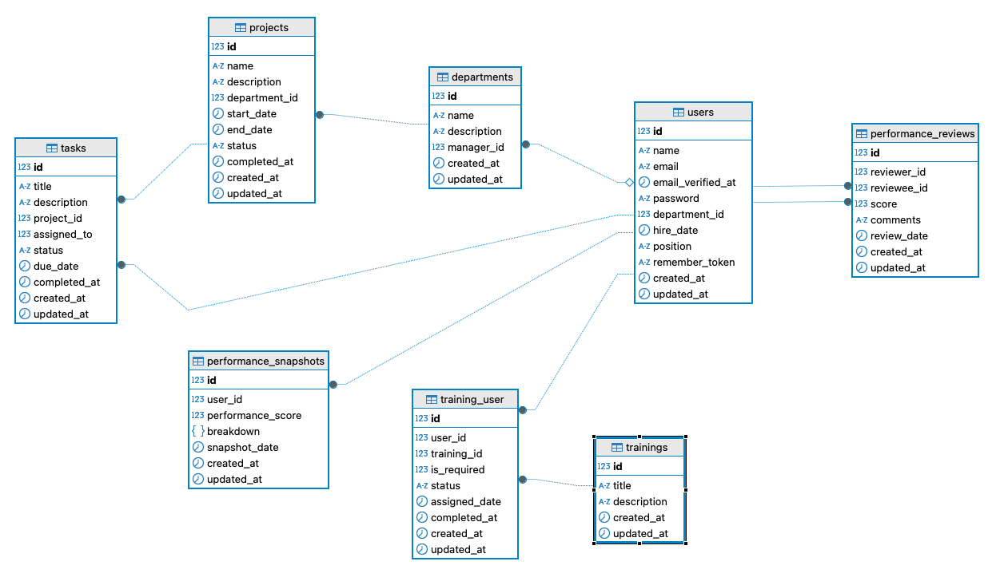

## Employee Performance Analytics System (EPAS)
A scalable, Laravel-based system for analyzing employee performance scores via a RESTful API. This project uses a modern, Dockerized architecture for easy setup.

## Technologies Used
Backend: PHP 8.4 & Laravel 12

Database & Caching: MySQL 8.0 & Redis

Web Server: Nginx

Development Environment: Docker & Docker Compose

## Database Design



## Getting Started
To set up the entire environment, including running migrations and seeders, simply run:

```bash
make setup
```

## API Documentation
For a complete and interactive list of all available API endpoints, please see the official documentation:

http://127.0.0.1:8084/docs/api